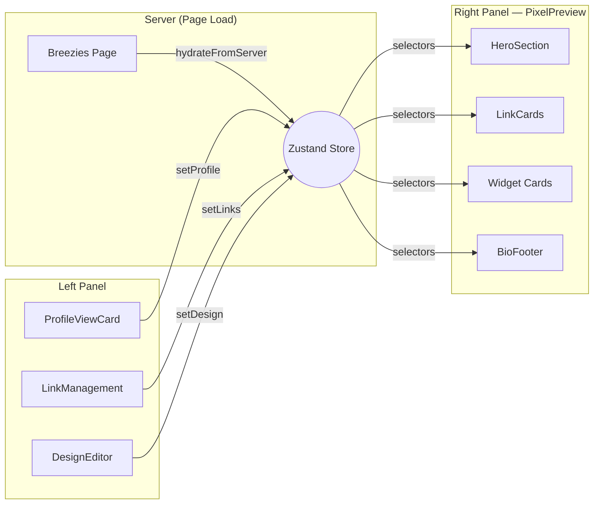

# Preview State Management

> Connecting the live phone preview to the admin editor panels using Zustand.

## Architecture Decision

| Approach | Verdict | Why |
|---|---|---|
| **Zustand** | ✅ **Chosen** | Already installed (v5.0.8), no Provider needed, selector-based re-renders, ~1KB |
| React Context | ❌ | Re-renders all consumers, needs Provider in server-component layout |
| TanStack Query | ❌ | Only covers links; profile + design + widgets would need fake queries |

## Data Flow



## Bio Component Map

The `PixelPreview` renders components from `components/shared/bio/`:

| Folder | Components | Store Slice |
|---|---|---|
| `bio/hero/` | `HeroSection` | `profile` (name, bio, avatar) |
| `bio/card/link/` | `LinkCard` | `links` array |
| `bio/card/spotify/` | `ArtistInfoCard`, `NewSongCard`, `NewAlbumCard`, `CurrentlyPlayingCard` | `widgets` (Phase 2) |
| `bio/card/wakatime/` | `DailyAverageTime`, `DevTool`, `TopLanguages`, `TopProjects`, `TotalCodingTime` | `widgets` (Phase 2) |
| `bio/card/intagram/` | `NewPost`, `ProfileCard` | `widgets` (Phase 2) |
| `bio/card/youtube/` | `NewVideoCard` | `widgets` (Phase 2) |
| `bio/card/product/` | `SingleProductCard` | `widgets` (Phase 2) |
| `bio/footer/` | `BioFooter` | `profile.username` |

## Store Shape

```ts
// stores/preview-store.ts
interface PreviewState {
  // Profile
  displayName: string;
  username: string;
  bio: string;
  image: string | null;

  // Design  
  backgroundColor: string;
  textColor: string;
  buttonStyle: string;
  fontFamily: string;

  // Links
  links: { id: string; title: string; url: string; order: number }[];

  // Widgets (Phase 2)
  widgets: { id: string; type: string; position: number; config: Record<string, unknown> }[];

  // Actions
  setProfile: (data: Partial<ProfileFields>) => void;
  setDesign: (data: Partial<DesignFields>) => void;
  setLinks: (links: LinkItem[]) => void;
  addLink: (link: LinkItem) => void;
  updateLink: (id: string, data: Partial<LinkItem>) => void;
  removeLink: (id: string) => void;
  hydrateFromServer: (data: ServerProfileData) => void;
}
```

## Usage Patterns

### 1. Hydrate from server data

```tsx
"use client";
export function PreviewHydrator({ data }) {
  const hydrate = usePreviewStore((s) => s.hydrateFromServer);
  useEffect(() => { hydrate(data); }, [data, hydrate]);
  return null;
}
```

### 2. Read in preview (selector-based)

```tsx
const displayName = usePreviewStore((s) => s.displayName);
const links = usePreviewStore((s) => s.links);
```

### 3. Write from editor

```tsx
// Profile edits
usePreviewStore.getState().setProfile({ displayName: newName });

// Link mutations
usePreviewStore.getState().setLinks(updatedLinks);
```

## Phased Rollout

| Phase | Scope | Status |
|---|---|---|
| **Phase 1** | Profile, links, design → store → preview | 🔜 In progress |
| **Phase 2** | Widget cards (Spotify, Wakatime, Instagram, YouTube, Product) | 📋 Planned |

## Key Principles

1. **Store = UI preview truth** — always reflects latest editor state
2. **Server seeds on load** via `hydrateFromServer`
3. **TanStack Query = persistence truth** — store is only for live preview
4. **Selectors prevent re-renders** — each component subscribes to its slice
5. **No Provider needed** — Zustand stores are module-level singletons
